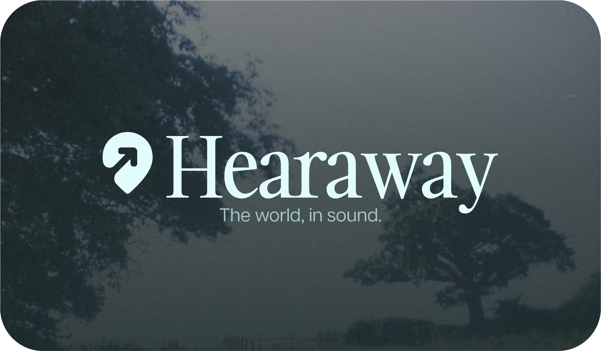

<p align="center">
  
</p>
<p align="center">
  <i>An adaptive ambient soundscape application that brings the world's environments to life through audio.</i>
</p>

---

### Features
- Adaptive soundscapes based on geographic location and biomes
- Dark/light theme support with smooth transitions
- Audio playback with spatial awareness
- Geospatial data processing using biome and weather data
- Responsive design with Framer Motion animations

---

### Tech Stack
- **Framework:** Next.js 15 with App Router
- **UI:** React 19, Tailwind CSS, Framer Motion
- **Geospatial:** Turf.js, rbush, GeoJSON
- **Audio:** Custom audio provider with adaptive playback
- **Language:** TypeScript

---

### Getting Started
Install dependencies:
```bash
npm install
```

Run the development server:
```bash
npm run dev
```

Open [http://localhost:3000](http://localhost:3000) in your browser.
